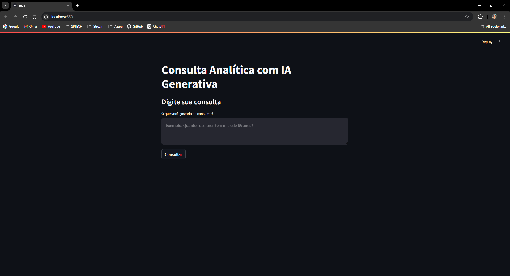
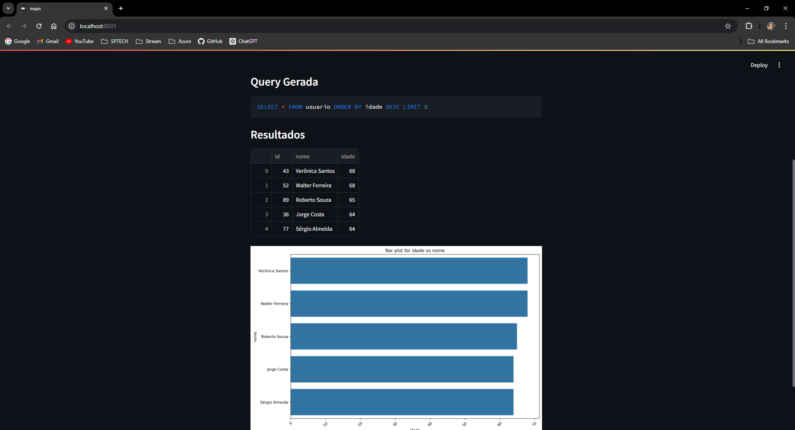

# Projeto: Insight IA

**Insight IA** é um sistema de consultoria em banco de dados que utiliza inteligência artificial para interpretar comandos em linguagem natural e transformá-los em consultas SQL otimizadas. Projetado para facilitar a interação com bancos de dados, o Insight IA permite que usuários de todos os níveis obtenham insights valiosos de seus dados de maneira intuitiva e eficiente, sem a necessidade de profundo conhecimento em SQL. Com a integração de tecnologias de ponta, o sistema também gera visualizações gráficas automáticas, tornando a análise de dados mais acessível e visualmente atraente.

## Funcionalidades

- O sistema permite que os usuários façam perguntas ou instruções em linguagem natural, que são automaticamente convertidas em consultas SQL.
- A IA gera consultas SQL otimizadas com base nas instruções fornecidas, facilitando o acesso aos dados sem a necessidade de conhecimento técnico avançado.
- Integração com bibliotecas de visualização (como Matplotlib e Seaborn) para gerar gráficos como barras, linhas, pizza e dispersão, conforme os resultados da consulta.


## Screenshots



## Tecnologias utilizadas

- Python.
- Ollama.


## Estrutura do Projeto

```bash
insight-ia/
│
├── app/
│   ├── __init__.py               # Arquivo de inicialização do pacote `app`
│   ├── main.py                   # Arquivo principal que inicializa a aplicação Streamlit
│   ├── config/
│   │   └── env.py                # Arquivo responsável por buscar as variáveis de ambiente
│   ├── interface/
│   │   ├── __init__.py           # Arquivo de inicialização do subpacote `interface`
│   │   └── layout.py             # Definições da interface com Streamlit
│   ├── services/
│   │   ├── __init__.py           # Arquivo de inicialização do subpacote `services`
│   │   ├── database.py           # Lógica para conexão e consultas ao banco de dados
│   │   └── ai_generator.py       # Integração com o CodeLlama e geração de queries
│   └── utils/
│       ├── __init__.py           # Arquivo de inicialização do subpacote `utils`
│       └── validators.py         # Funções de validação e segurança das queries
│ 
├── example-db/
│   └── script.sql                # Arquivo com exemplo de banco de dados para teste
│
├── requirements.txt              # Lista de dependências do projeto
├── .env                          # Arquivo de variáveis ambientes
├── README.md                     # Documentação do projeto
├── .gitignore                    # Arquivos e pastas a serem ignorados pelo Git
└── setup.py                      # Script para configuração e instalação do projeto
```
    
## Como Utilizar

- Python instalado
- [Ollama](https://ollama.com/download)

- Instruções para baixar o LLM codellama:
```cmd
ollama run codellama
```

- Configurar projeto:
```bash
python setup.py
```

- Iniciar projeto:
```bash
source venv/Scripts/activate
streamlit run app/main.py
```

## Variáveis de Ambiente

Para rodar esse projeto, você vai precisar adicionar as seguintes variáveis de ambiente para conexão com o mysql no seu .env

`DB_HOST`

`DB_USER`

`DB_PASSWORD`

`DB_NAME`

`DB_PORT`


## Autores

- [@KauanCavazani](https://www.github.com/KauanCavazani)

